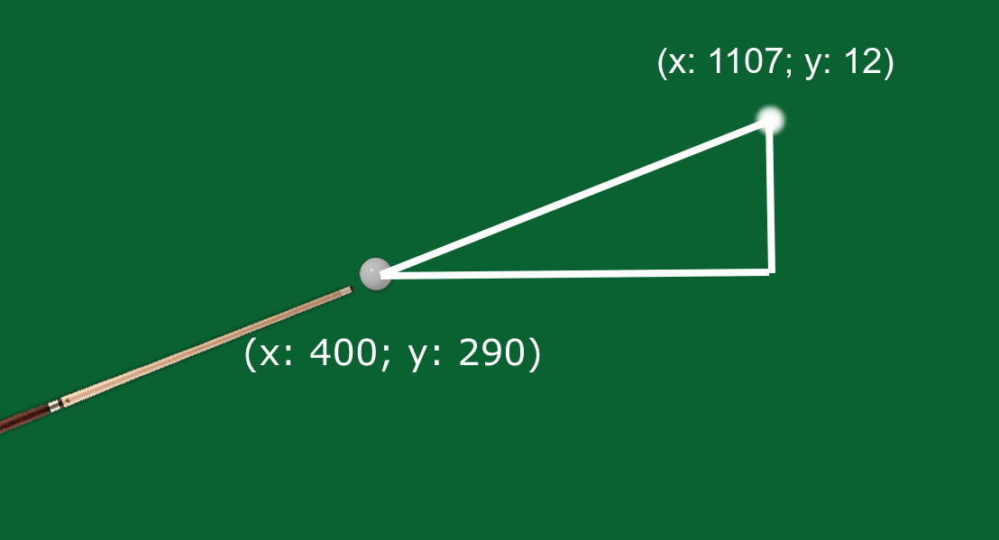

# Billiards
## Applications of geometry in billiards game programming

<i>Billiards</i> game is a game that uses geometric math a lot, and I made this game for the purpose of learning, studying, and improving my geometric math.

To make this game we'll need to apply a lot of geometry math, here we use <b>vectors</b> and <b>trigonometry</b>.

### What are vectors used for?
- They are used to determine an object's position, or velocity.

### What are trigonometric used for?
- They are used for the purpose of calculating the angle of an object.

## How did I apply them in programming



For example, we have ball position (x<sub>1</sub>: 400; y<sub>1</sub>: 290) and mouse position (x<sub>2</sub>: 1107; y<sub>2</sub>: 12).

How do we calculate the angle of the stick?

1. First we need to calculate the <b>opposite side</b>:

   

2. Next, we have to calculate the <b>hypotenuse side</b>:

   

3. After calculate the <b>opposite</b>, <b>hypotenuse</b> sides then we calculate the angle of the stick (use <b>inverse sine</b>):

   
   
4. We need to check if x<sub>1</sub> > x<sub>2</sub> then the angle = <b>180°</b> - angle: ``angle = 180 - angle``.
5. If the angle < 0 then the angle will add <b>360°</b>: ``angle += 360``.

Finally the angle of the stick is <b>158.524°</b>.

<details>
<summary>Full of the code:</summary>
   
```cpp
double opposite = vector2.getY() - vector.getY();
double hypotenuse = std::hypot(vector2.getX() - vector.getX(), vector2.getY() - vector.getY());

double degrees = (std::asin(opposite / hypotenuse) * 180) / PI + 180;

if (vector.getX() > vector2.getX()) degrees = 180 - degrees;
if (degrees < 0) degrees += 360;

stick->setAngle(degrees);
```
   
</details>

And if you click on the screen, the stick will automatically move backwards, to do that we need:

1. Calculate the angle of the mouse:
  
   - The <b>opposite side</b>:  
   - The <b>adjacent side</b>:  
   - Use <b>atan2</b> function: 
    
2. Change the position of the stick:
   - stick's x add <b>5 * cos(-0.37463)</b>.
   - sticks's y add <b>5 * sin(-0.37463)</b>.
   
```cpp
velocity = Vector(-5 * cos(angle), -5 * sin(angle));
position.addTo(velocity);
```
