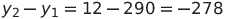
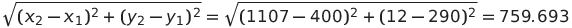
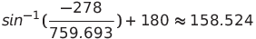
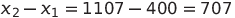
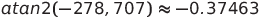

# Billiards
## How is math used in billiards programming?

Billiards game is a game that uses geometric math a lot, and I made this game for the purpose of learning, studying, and improving my geometric math.

In this game, the most used are trigonometric formulas which the students think they are useless.

To make this game I use vectors and some math formulas (trigonometric formulas).

### What are vectors used for?
- They are used to determine an object's position, or velocity.

### What are trigonometric formulas used for?
- They are used for the purpose of calculating the angle of an object

## How i used them

- For example, we have mouse position (x<sub>2</sub>: 1007; y<sub>2</sub>: 12) and ball position (x<sub>1</sub>: 400; y<sub>1</sub>: 290)


How do we calculate the angle of the stick?

1. First we need to calculate the opposite:

   

2. Next, we need to calculate the hypotenuse:

   

3. After calculate the opposite and hypotenuse then we calculate the angle of the stick (use inverse sine):

   
   
4. We need to check if x<sub>1</sub> > x<sub>2</sub> then angle = 180° - angle.
5. If the angle < 0 then the angle will add 360°

Finally the angle of the stick is 158.524°

Full of the code
```cpp
double opposite = vector2.getY() - vector.getY();
double hypotenuse = std::hypot(vector2.getX() - vector.getX(), vector2.getY() - vector.getY());

double degrees = (std::asin(opposite / hypotenuse) * 180) / PI + 180;

if (vector.getX() > vector2.getX()) degrees = 180 - degrees;
if (degrees < 0) degrees += 360;

stick->setAngle(degrees);
```

And when you click on the screen, the stick will automatically move back, to do that we need do:
1. Calculate the angle of the mouse:
  
  - Opposite:  
  - Adjacent:  
  - Use atan2: 
    
2. Change the position of the stick:
  - stick's x add 5 * cos(-0.37463)
  - sticks's y add 5 * sin(-0.37463)
